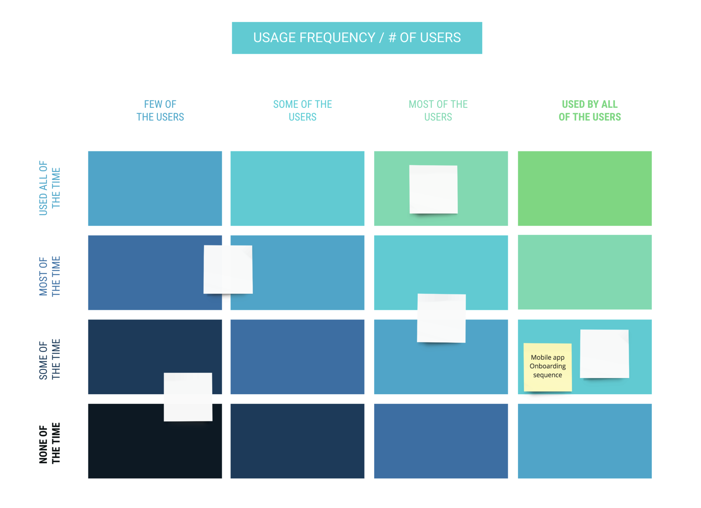
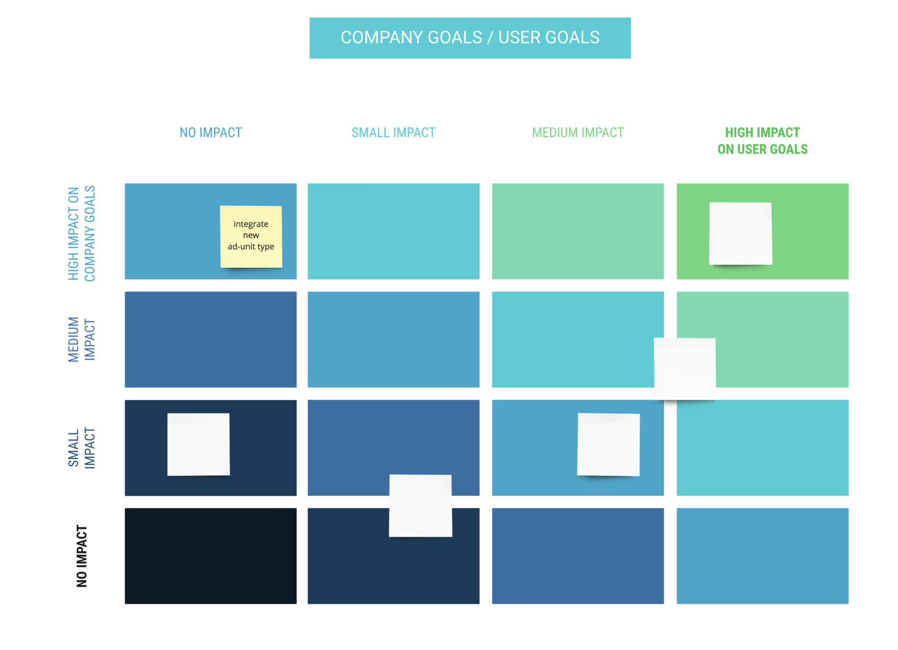
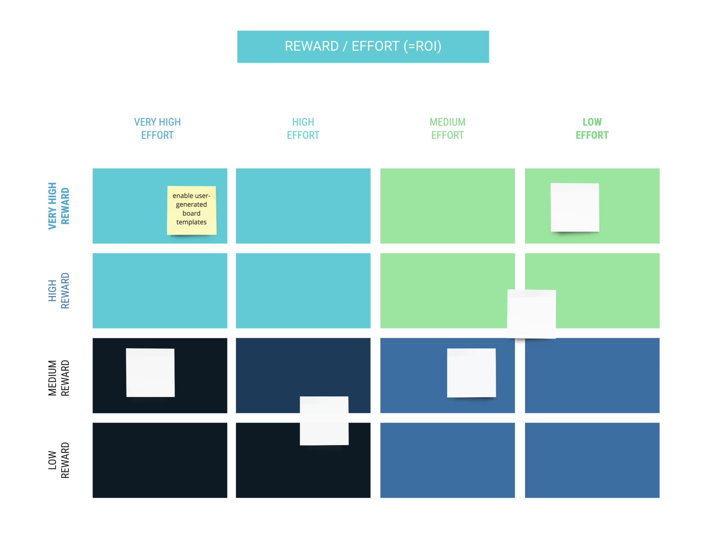
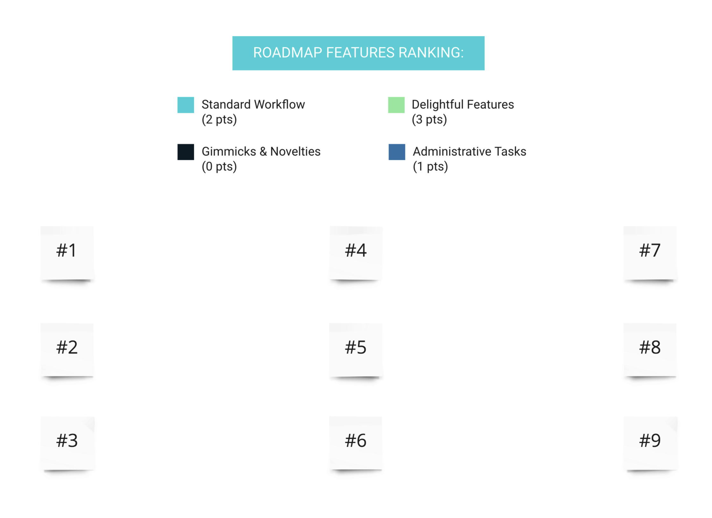
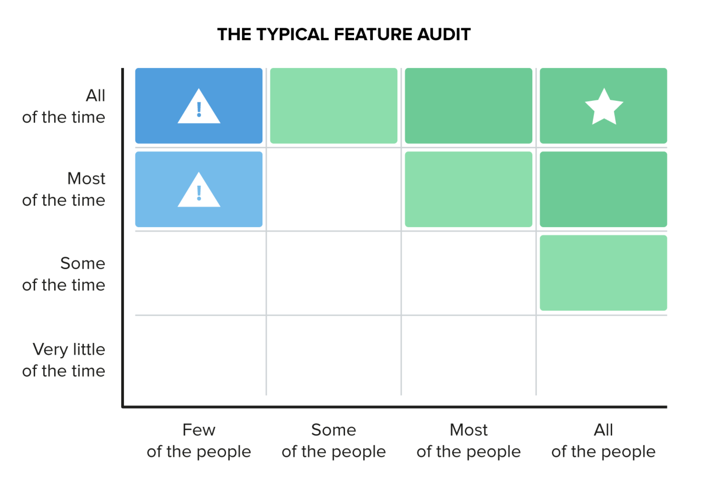
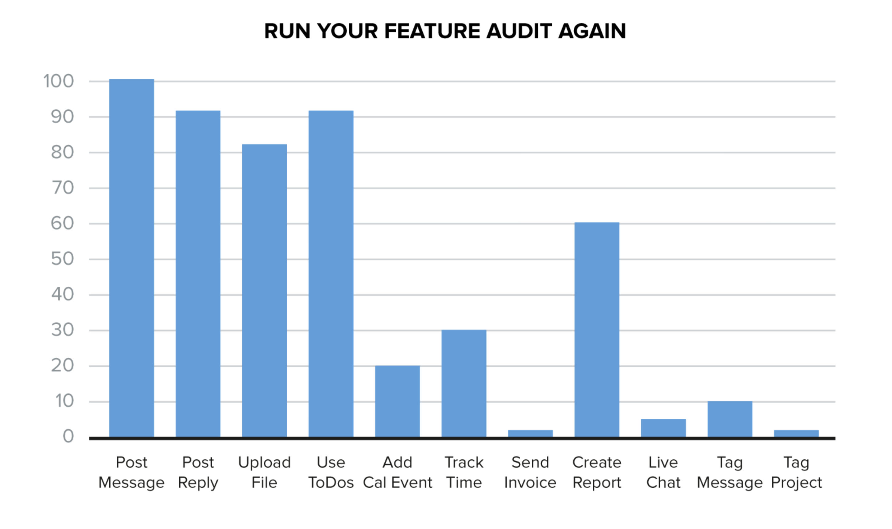
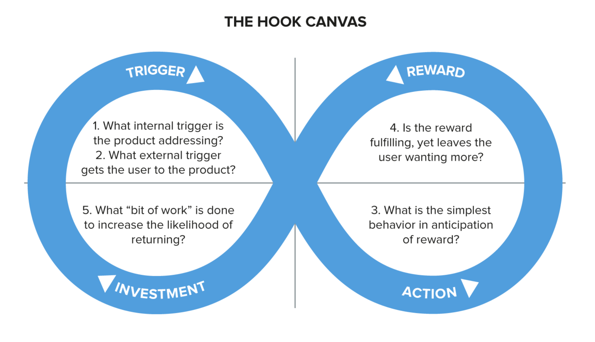

# Feature Audit

## Points-based Ranking
See: [Features Prioritization Tool](https://miro.com/miroverse/category/workshops/features-prioritization-tool)

## Feature Adoptation Ranking

* The core value of your product is in the top right area, up where the star is, because that's what people are actually using your product for.
    * Note: Exclude administrative features like account creation, password reset, etc. from this exercise. They're not relevant here.
    * Also, exclude features that only certain users (e.g. enterprise customers) can access. They should be evaluated separately.
* If you have features in the top left it's a sign of features with poor adoption.
* An even simpler way to think about it is this: What percentage of your customers or users have adopted each feature? You can do this with simple bar charts.

### What do you do with your feature audit?
* For any given feature with limited adoption, you have four choices:
    * **Kill it**: Admit defeat, and start to remove it from your product
    * **Increase the adoption rate**: Get more people to use it
    * **Increase the frequency**: Get people to use it more often
    * **Deliberately improve it**: Make it quantifiably better for those who use it

### Deliberate Improvements
* Use deliberate improvements when: there is a feature that all your customers use and like, and you see opportunity to add significant value to it.
* It’s worth noting that deliberately improving a well-adopted frequently used feature is high risk high reward.
    * As an example think about improving the editor in a blogging platform.
    * Get it right, and every single users gets the benefit every time they use it.
    * Get it wrong and you’ve broken the workflow of your entire userbase. High risk, high reward.

### Frequency Improvements
* Use frequency improvements when: there is a feature that the majority of your customers use infrequently, and you believe that using it more would be of benefit to them.
* It’s worth considering how your business will profit from this increased frequency.

#### The Hook Model

* **Trigger**: the reason the user goes to the product (e.g. you received an email to say a contact had endorsed you for a skill).
* **Action**: they take in anticipation of the reward (e.g. scroll, search, browse, etc).
* **Reward**: the user gets from taking their action (e.g. seeing a beautiful Pinterest board).
* **Investment**: the user makes which will plant the seed for more triggers (e.g. subscribe, pin, like, connect, etc)

### Adoption Improvements
* Adoption improvements target those who don’t use a feature. To get more people using it, rank and resolve the issues that are stopping them from using it.
* This is where the five whys technique is genuinely useful. You might have a situation around users not using your reports feature:
    * Why? They don’t see the value.
    * Why? They can’t show it to their boss.
    * Why? They can’t get it into a suitable good format.
    * Why? Because our export tools aren’t good enough?
    * Why? Because our API doesn’t produce good data.
If you ask why enough times, even- tually you’ll work it out and get to the root cause.

## Templates
* [Features Prioritization Tool](https://miro.com/miroverse/category/workshops/features-prioritization-tool)

## References
* [Product Management Guide From Intercom](assets/Product-Management-Guide-From-Intercom.pdf)
