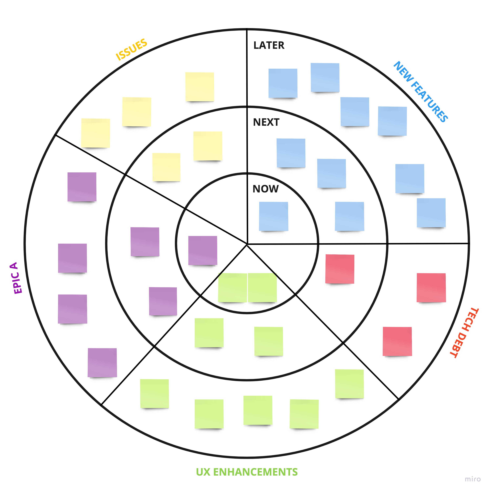
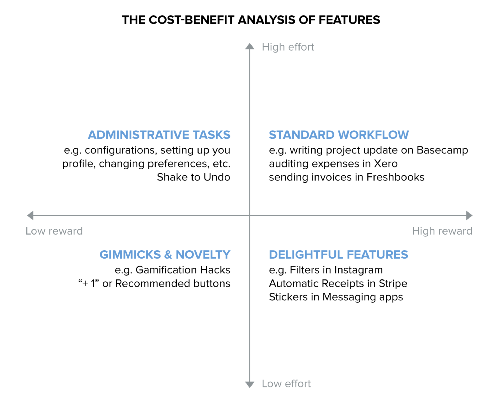
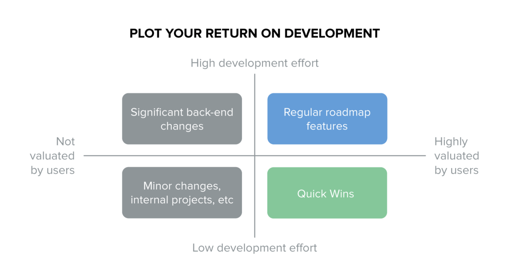

# Roadmap

## Visualization

## Prioritization

### Points-based Ranking
See: [feature-audit](feature-audit.md)

### Non-Deadline
* Near-term
* Mid-term
* Long-term

### MOSCOW Method
* Must have
* Should have
* Could have
* Won't have

## Jobs-to-be-Done: Making things people want
* If you understand the "job" that customers are hiring your product to do, then you can make sure that you have a razor sharp focus on helping them achieve the desired result.
* The features you choose to build should be the ones that will help them do the job that needs to be done.
* When you're building or managing a new product, you have to believe you can create a better solution that people will want to use because it delivers a better outcome for them.
* A strong understanding of the outcome customers want, and how they currently get it, is essential for you to succeed in product management.
* Focusing on outcome, rather than category, industry, or product type, lets you understand your real competitors.
* The second a company focuses on "the industry it's in" rather than the "outcome it delivers", it loses touch, and shortly after, loses customers.
* Making things people want involves understanding a long standing human or business need and then using technology to:
    * **Take out steps**: Find the simplest smallest set of steps possible to deliver the outcome/job-done
    * **Make it possible for more people**: Reduce the cost (in time or money) and remove barriers to usage
    * **Make it possible in more situations**: Remove common situational limitations and workflow frictions
* Remember: It's easier to make things people want, than it is to make people want things.

## Adding New Features
* New features are risky. You have to be very confident they will be valued, as they're like children; you have to support them no matter what.
* Ask your customers "Would you like a (Calendar/TimeTracker/Gantt Chart)?" and they'll reply "Yes".
* It's a one-way "something for nothing" offer; why wouldn't they? They haven't had to make a trade-off between competing priorities.
* This leads to customers saying they want stuff that they don't really want.
* Asking your customers "Would you rather that we made the product much faster, or that we added more labelling features?" and you'll get a different answer.
* Everyone values speed. So when planning new features it's important to understand the trade-offs at play.
* A road-map is built out of hard decisions. The bugs you must fix will fight with the features you must finish, the features your customers want will compete with the ones you know they need.
* If you focus only on new features you'll build a product that is miles wide and inches deep. And if you focus only on repairs you'll never innovate, thus becoming irrelevant. Hard decisions indeed.
* When you are focusing on improving your product, a great question to ask is:

### Where do we suck, and where does it matter?
* To improve a product you focus on the parts that are both important and disappointing to customers.
* Both are required otherwise you'll end up working on areas that no one cares about, or over-serving areas where you're already more than good enough.

### An acid test for new features
* Product strategy means saying "no".
* Roadmaps are incredibly hard and require agonising trade-offs, but regardless, every good product manager needs a firm checklist for when they say yes, and when they say no. And they don't make exceptions.
* Yes/No questions that you can quickly answer before you add another feature to your product roadmap (your new feature must score straight yes's on all questions):
1. Does this feature fit your vision?
2. Will this feature still deliver value in five years time?
3. Will everyone benefit from this feature?
4. Will this feature improve, complement or innovate on the existing workflow?
    * Improve: Greater customer satisfaction and/or maybe a decrease in tool time, or support requests.
    * Complement: Increased throughput because it now works in more cases or can be used in more circumstances.
    * Innovate (A "whole new way")?: New customers acquired as a result of the PR, marketing or awareness created.
5. Will this feature grow the business (increase upgrades, reduce churn)?
6. Will this feature generate new meaningful engagement?
7. If this feature succeeds, can we support and afford it?
8. Can we design the feature so that reward of using it is greater than effort?

9. Can we implement this feature well?
10. Can we scope this feature well?

## Return on development effort

* Schedule quick wins to cover time periods where it would otherwise appear that nothing is happening.
* This way you're constantly delivering value to your customers whilst still tackling larger features or back end problems.
* Remember the only thing worse than an app in constant flux, is one where users can see cobwebs forming.

## Saying "No" to Adding New Features
* Product managers, or founders fulfilling that role, have to be great at saying "no". Not "maybe" or "later". The only word is "No".
* Building a great product isn't about creating tons of tactically useful features which are tangentially related. It's about delivering a cohesive product within well defined parameters.
* When your product gets traction, you'll find yourself inundated with good ideas for features. These will come from your customers, your colleagues, and yourself.
* Because they're good ideas, there will always be lots of reasons to say yes to them. Here's 12 arguments that are commonly used to sneak features into a product:

### 1. But the data looks good
* "We've tried this feature with a small group and engagement is off the charts." Often this approach suffers from selective data analysis. Products are complex systems.
* What appears to be an increase in engagement is really just pushing numbers around from place to place.
* You might consider your labels feature a success based on its usage, but did you notice that that your tags feature is suddenly no longer popular?
* Even when the data is solid, and the increase in engagement is good, you still have to question whether it fits within the purview of the product.
* Add Tetris to your product and you'll probably see a boost in engagement, but does that mean your product is better?

### 2. But it'll only take a few minutes
* The main problem with this argument is that the scope of work should never be a reason to include a feature in a product.
* Maybe it's a reason to bump it up the roadmap as a quick win, but that's a roadmap decision, not a product one.
* Lots of bad ideas can be built quickly. Don't be seduced. **There are no small changes.**
* Even the tiniest additions add hidden complexity that isn't accounted for in the "but it's just 5 minutes" estimate.

### 3. But this customer is about to quit
* This is feature blackmail. No customer can be more important than a good product. The road to consulting-ware is signposted "just this once for just this customer".
* It leads to the perfect product, for just one customer, and even then their loyalty now depends on you doing what they say.
* Delivering extra value to one customer comes at the cost of taking value away from many others.

### 4. But we can just make it optional
* This leads to death by preferences. Making features optional hides the complexity from the default screens in the interface, but it still surfaces everywhere else.
* The visible cost of this is a messy interface with lots of conditional design and heaps of configuration.
* The hidden cost is that every optional feature weakens your product definition.
* You become "a time tracker that can also send invoices and, sorta, do payment reconciliation.

### 5. But my cousin's neighbour said...
* This is the "appeal to the anecdote". It is rife in consumer products, and in SaaS companies that can't decide what precise jobs they do.
* Extrapolating from a tiny sample is an easy way to bypass years of experience, research, data, and behavior to make a statement that sounds reasonable.
* Saying "my brother's company use Google Analytics, they all use advanced segments" is an easy way to make a case for advanced segments, bypassing key questions like:
    * What your product actually does
    * Whether your brother's company are a good target customer
    * Whether they actually use it or just say they do
    * Whether advanced segments are actually the right solution for what your customers are trying to do

### 6. But we've nothing else planned
* The devil makes work for idle product teams, and boy does he come up with some shitty features.
* The problem here is someone sees one or more engineers sitting idle and immediately rushes through a new feature to "keep ‘em busy".
* Decisions are rushed and designs are cobbled together all in the name of avoiding idle time. This is a bad way to "improve" a product.
* Instead of adding to technical debt here, there's an opportunity to pay some off. Idle time is best used fixing bugs, cleaning up test suites, refactoring, etc.

### 7. But we're supposed to be allowed to work on whatever we want
* This argument appeals to cultural pride. There are many big name companies that promise engineers they can build whatever they want and ship it.
* Usually this promise has one of two outcomes:
    * It's a lie told to attract engineers. This gets noticed quickly and falls apart. You can't fake culture.
    * It's true. The end result is a one-size-fits-none product full of half-baked ideas.
* There's a difference between encouraging engineers to build things internally (a good thing) and letting people add features to a product bypassing product management (a bad thing).

### 8. But 713,000 people want it
* Always beware when someone falls back to raw numbers to justify something. Any product with any amount of traction can make an emotive claim using numbers.
* Such a claim forces you to take off your product design hat, and be one of the "people". Are you really going to say no to all those faces?
* You have to. Because the majority of your users will suffer otherwise. The question is: "is this a valuable feature, within our purview, that all our customers will use?".

### 9. But our competitors already have it
* That doesn't mean it's a good idea. It could be something they're trying out. It could be a shit idea. It could be something they're planning on killing.
* It's a mistake to assume that your competitors are in any way smarter or more tactical than you.
* Obsessing about your competitor's features relegates you to permanently delivering "yesterday's technology tomorrow".

### 10. But if we don't build it, someone else will
* That doesn't mean it should be in your product. If someone else builds it, do customers no longer need your product? Will they all switch over?
* Simply saying "someone else will" sounds good, but means nothing. We've all caught ourselves saying it.
* Often it's the logic used to expand a product because you're not willing to admit your product stops somewhere. You're afraid to draw the line.

### 11. But the boss really wants it
* If the boss is also the product manager, and has the necessary time and insight to make smart holistic decisions, then this is fine.
* However, if someone is trying to earn brownie points by focusing on pet projects that their manager has a penchant for, this inevitably leads to trouble.

### 12. But this could be "the one"
* This is a classic "Appeal to the Unknown". Editing a product requires some hard decisions about what to build.
* You can speculate that any unbuilt feature could transform your product. But speculation is all it is, nothing more.
* When you're afraid to make hard decisions, you fall back on appealing to the unknown, and therefore building everything.
* You end up with a repository of features, not a product.

#### Why is "no" important?
* The thing is, no one keeps crap ideas in their roadmap. Identifying and eliminating the bad ideas is the easy bit.
* Real product decisions aren't easy. They require you to look at a proposal and say:
* "This is a really great idea, I can see why our customers would like it. Well done. But we're not going to build it. Instead, here's what we're doing."

## Killing Features
* To solve feature creep you need to identify which features are being adopted by everyone, and which ones are struggling to gain traction. It's time again to run the [feature-audit](feature-audit.md):
* Keeping a feature that has no adoption requires design and communication. You need to target the users who are using it, and work out why. Target some users who aren't, and work out why.
* Features struggle for adoption for lots of reasons, users don't see the value in using it, they find it too complicated, it's hidden somewhere clever in your product, they're the wrong type of users, and dozens more.
* This is why it's important to say "no." When you're faced with a feature that only 8% of your user base are using, you have to make a call: Kill it or Keep it.
* Killing a feature can take many forms, you can hide it from new users, message current users to explain your decision and give them time to prepare. Or you can just tear it out of the UI and never mention it again.
* Both work, with varying amounts of overhead. The bigger the product i.e. the more users you have, the less you get away with dramatic moves.

## Roll-outs

### Stages
1. **Team testing**: The first step is to deploy it live with real data, but only visible to the team that built it.
    * This is important because it avoids too many people reporting the same issues but also permits a release before every single step is perfect.
    * The team themselves know how far they've gone, so they alone can tell what's a bug versus what's simply incomplete.
2. **Company testing**: When a team believes their feature is complete, it is released it to the entire company who immediately use it in their workflow.
    * There are no elaborate explanations, tutorials, or excuses. It's simply shipped, just like we intend to ship it to customers.
3. **Restricted beta**: The first public release is to a single digit percentage of users. Maintain a "Trusted Testers" group for this purpose.
    * Communicate it as a beta, and specifically ask for feedback later, once they have used it. That final point is subtle, but it's worth remembering.
    * Feedback on what it's like to use a feature can only come from people who have used it. Not people who tested it or played around with it. (See metrics below)
    * During restricted beta you can ensure it's discoverable for all users, refine your marketing to focus on pitching the true value as your customers see it, and you can resolve barriers to usage and adoption.
4. **Full roll-out**: (See below)

#### Restricted Beta Metrics
* **Discoverability**: Are people finding this feature?
* **Engagement** Are people using this feature?
* **Adoption**: Is this feature now being used as part of a workflow?
* **Use Cases**: How is this feature being used? What use-cases are popular?
* **Barriers**: Who isn't using this feature? Why? What's preventing them?

### Full roll-out
* This is when it's available to everyone who is eligible for it and you need to think about how you are going to tell them.
* Typically not all features are avail- able to all users – there's some basic price discrimination at play – so at a minimum you split your message into the "haves" and "have-nots".
* Those eligible for the feature should be sold on it. Feature announcements are often very inward looking, focusing much more on "what we did", rather than "what you can do".
* If you want people to use your product, encourage them by showing them what they can use it to achieve.
* Those ineligible should be sold on the feature as a reason to upgrade. Often you can achieve this with a free trial (e.g. Try our premium plan for one month free).

#### Message schedule for the feature
* Once a feature is launched it's easy to forget about it and move on to the fun of designing the next one. But features without engagement are the seeds of bloatware.
* For any significant feature, you need to have plans for those who use it, and those who don't.
* When people are using it well, you want to gather use cases, and marketing collateral from them for future use. Depending on your plans you may also want feedback.
* When people aren't using it, you want to encourage them, educate them, and engage them, the only acceptable outcome here is they'll start using it, or they'll tell you why not.
* There is no pride in having a "big" product with lots of features, only a highly engaged one. The more surface area your product has, the more important it is that you chase engagement and learn from your mistakes.
* This is most important when you're young and scrappy. You're capable of shipping a new feature every week, but you should focus that energy on growing usage of your prod- uct, not growing your product.

#### Getting that feature used
* The thing is, unless customers use a feature it may as well not exist. This is often forgotten in the rush to ship fast.
* It's not just about shipping code to servers, or checking boxes on a roadmap, it's about getting your software used.
* So before you ship that next feature, ask yourself these questions:

1. Will everyone see it (discoverability) and understand it?
2. Are you showing users what you did, or what they can do?
3. Are you announcing it in the context of an in-app task?
4. Do you plan to follow up with users & non-users?
    * Once a feature is live, you should follow up with those who use it to understand how, why, and when it's used.
    * Look for ways to increase usage of it. Here's some questions I've asked customers about a new feature:
    * When did you notice it? What did you think? Did you use it straight away? What attracted you to it?
    * Did you need to read the documentation? Was it sufficient?
    * Were there any barriers to you using it?
    * Are there times in your work day that you want to use this but can't?
    * Have you told anyone about what you use it for? What did you say?

## 6 Signs of a Poor Product Roadmap
* The goals are not measurable
* No results in the first 6 weeks for a startup (6 months for a company), and you don't make any changes
* The roadmap changes every week
* Roadmap formula components are unbalanced
* The team doesn't understand or share priorities from the roadmap
* Product roadmap is groundless

## Templates
* [Product Roadmap](https://miro.com/templates/product-roadmap)
* [Features Prioritization Tool](https://miro.com/miroverse/category/workshops/features-prioritization-tool)
* [8 Different Ways to Organize Your Backlog](https://miro.com/miroverse/category/strategy-and-planning/8-different-ways-to-organize-your-backlog)

## References
* [How to build a product roadmap that truly works](https://miro.com/blog/building-product-roadmap-template)
* [How do I know that the product roadmap doesn't work?](https://miro.com/blog/building-product-roadmap-template)
* [Product Management Guide From Intercom](assets/Product-Management-Guide-From-Intercom.pdf)
